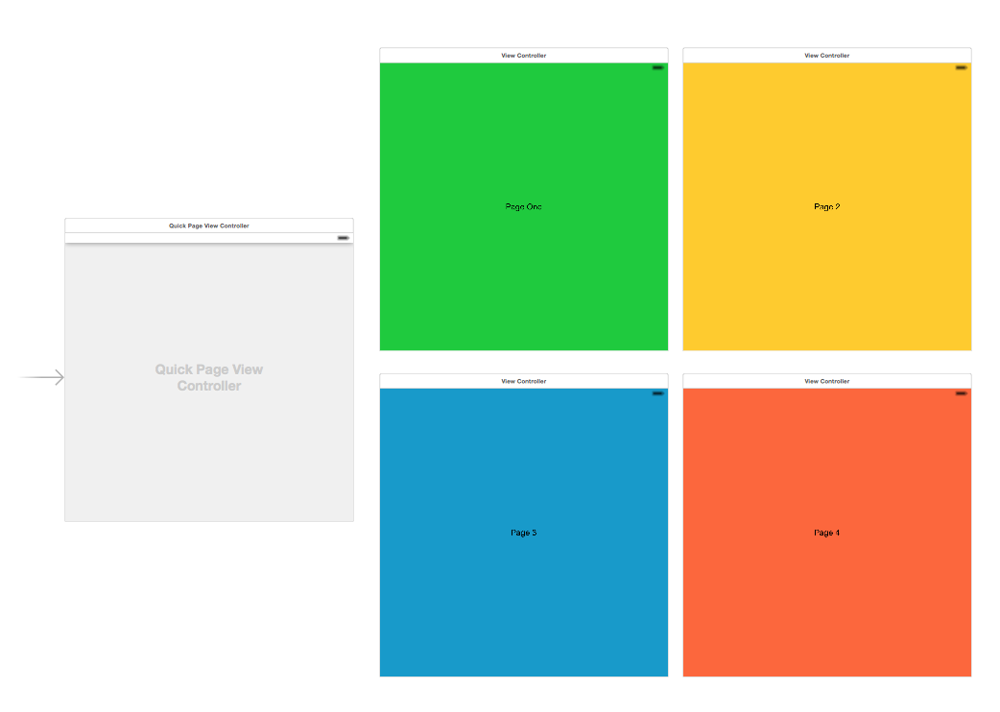
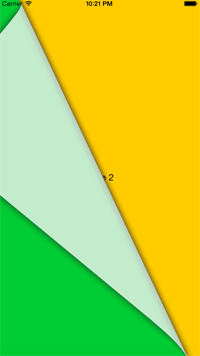
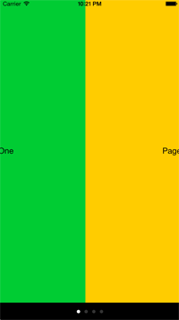
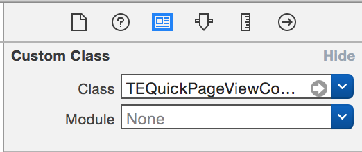
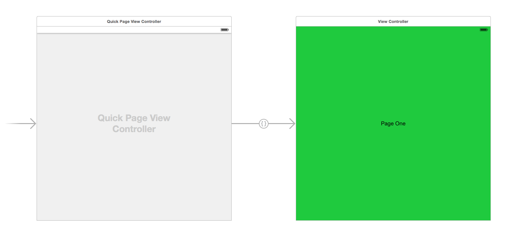
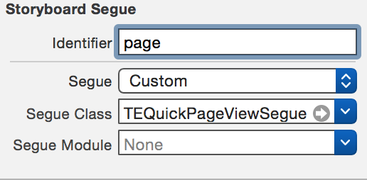
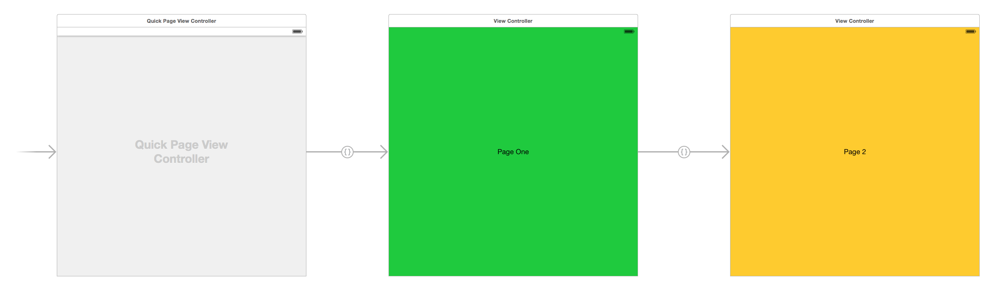
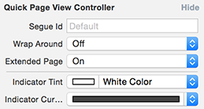

# TEQuickPageViewController

An extension of UIPageViewController to allow adding Views to a Page View directly in your Storyboard, **without any additional code**.

Just create your Page View Controller in storyboard, add a few segues, and you have a working set of paged views.

TEQuickPageViewController supports Page Curl and Scroll transition types, as well as a two-page view with a Spine Location of "Mid".

## Changes in this version

Version 2 replaces the identifier-based method of linking views with a set of custom segues, to allow you to see the relationship between your controller and pages at a glance.

If moving from version 1, you will need to add segues as detailed in the setup instructions below.

## Installing

### CocoaPods

If you're using CocoaPods, just add the below to your podfile:

    pod "TEQuickPageViewController", '~> 2.1'

### Direct

To include the required source directly, just add these files to your project:

* TEQuickPageViewController.h
* TEQuickPageViewController.m
* TEQuickPageViewSegue.h
* TEQuickPageViewSegue.m

## Setting Up Your Page View

First, you'll need to prepare your UIPageViewController:

* Drag a *Page View Controller* into your Storyboard
* In the Page View Controller's Identity Inspector, set the class to *TEQuickPageViewController*

## Adding Pages

To add a page to your sequence of pages, you will need to connect it to your controller or preceding pages:

* Drag a *View Controller* into your Storyboard
* Add a *custom* segue between your Page View Controller and the new View Controller.

* Set the segue's class to *TEQuickPageViewSegue* and the Identifier to "page"

To add a second page, just drag another View Controller into your view and add another custom segue with the same settings, this time from your first page. This will create a chain of pages in your storyboard.

## Additional Features

### Extended Views (get rid of the black bar!)

You'll probably have noticed the ugly black bar that appears at the bottom of your view when using the scroll transition.

To get rid of this, you can set up your TEQuickPageViewController to extend your pages across the entire view. Just open the Attributes inspector of your TEQuickPageViewController and set "Extended Page" *On*.

Bingo! No more ugly bar. Of course, you may need to change the scroll indicator colors

### Changing Indicator Colors

You may have seen in the above screenshot for Extended Pages that there are color options for "Indicator Tint" and "Indicator Current".

These control the color of the unselected page indicators and the currently selected page indicators respectively.

### Wrap Around

The Wrap Around attribute in your TEQuickPageViewController's attributes allows your pages to "wrap" from the end back to the beginning.

When disabled, the user will not be able to swipe backwards from the first page or forwards from the last page.

### Custom Segue Identifier

By default, your page segues need an identifier of "page", but this may not be desirable.

To specify your own identifier, just set the "Segue Id" attribute on your TEQuickPageViewController. You can now change the identifier for your segues to this string.

## Known Issues

### Cycles Cause Crashes

If you have a cycle in your chain of pages (such as connecting Page 1 -> Page 2 -> Page 1), this will result in an infinite loop when establishing the array of pages, and our app will crash.

It should be easy to see if you have a loop in your chain, and remove the problem segue.

## Example Project

*TEQuickPageViewController.xcodeproj* is a simple iOS app making use of the TEQuickPageViewController class. Feel free to open it up and play around!

## License

TEQuickPageViewController is available under the MIT license. See the LICENSE file for more info.