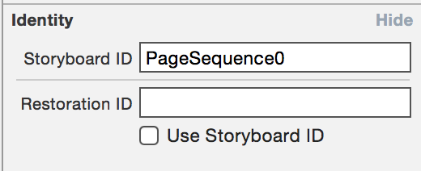

# TEQuickPageViewController

An extension of UIPageViewController to allow adding Views to a Page View directly in your Storyboard, **without any additional code**.

TEQuickPageViewController supports Page Curl and Scroll transition types, as well as a two-page view with a Spine Location of "Mid".

## Installing

### CocoaPods

If you're using CocoaPods, just add the below to your podfile:

    pod "TEQuickPageViewController"

### Direct

To include the required source directly, just add these files to your project:

* TEQuickPageViewController.h
* TEQuickPageViewController.m

## Setting Up Your Page View

First, you'll need to prepare your UIPageViewController:

* Drag a *Page View Controller* into your Storyboard
* In the Page View Controller's Identity Inspector, set the class to *TEQuickPageViewController*

* Open the Page View Controller's attribute inspector, you should see some new attributes for *Quick Page View Controller*. Set *Page Identifier Prefix* to a string of your choice that will identify your sequence of pages. Below, we've used "PageSequence"

## Adding Pages

To add a page to your sequence of pages, you need to identify the page as belonging to your TEQuickPageViewController:

* Drag a *View Controller* into your Storyboard
* In the View Controller's Identity Inspector, set the Storyboard Identifier to the Page Identifier Prefix plus the number of the page in order. Below, our first page has an identifier "PageSequence0"

Pages are numbered from 0, so the identity of our first three pages would be "PageSequence0", "PageSequence1", "PageSequence2" in this example.

## Additional Features

### Wrap Around

The Wrap Around attribute in your TEQuickPageViewController's attributes allows your pages to "wrap" from the end back to the beginning.

When disabled, the user will not be able to swipe backwards from the first page or forwards from the last page.

## Example Project

*TEQuickPageViewController.xcodeproj* is a simple iOS app making use of the TEQuickPageViewController class. Feel free to open it up and play around!

## License

TEQuickPageViewController is available under the MIT license. See the LICENSE file for more info.